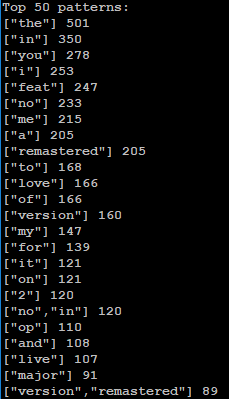

# Spotify Frequent Pattern Generator 

This project pulls several thousand song titles using [Spotify's web API](https://developer.spotify.com/dashboard/ "Spotify Developers") and looks for frequent patterns in the words used. This is acomplished using the [FP-Growth](https://en.wikipedia.org/wiki/Association_rule_learning#FP-growth_algorithm) and FP-Growth+ algorithms. 

Example Output
---

More information can be found in this [report](FPGrowth_report.pdf)
